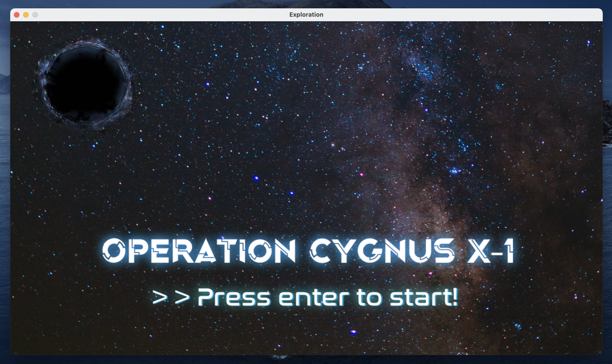
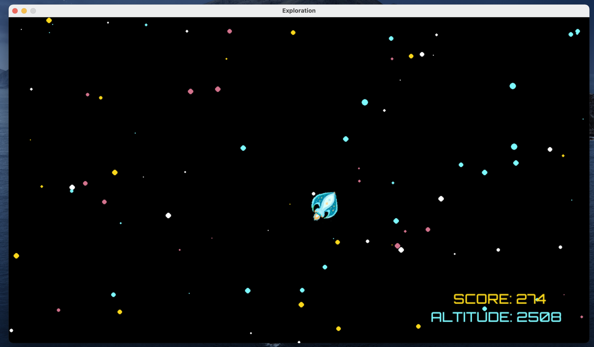
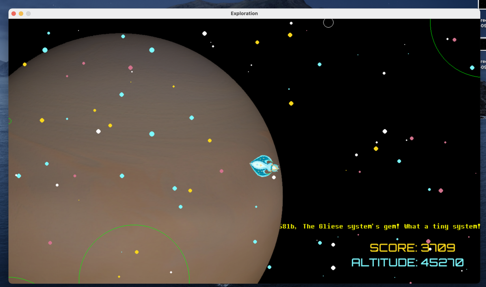
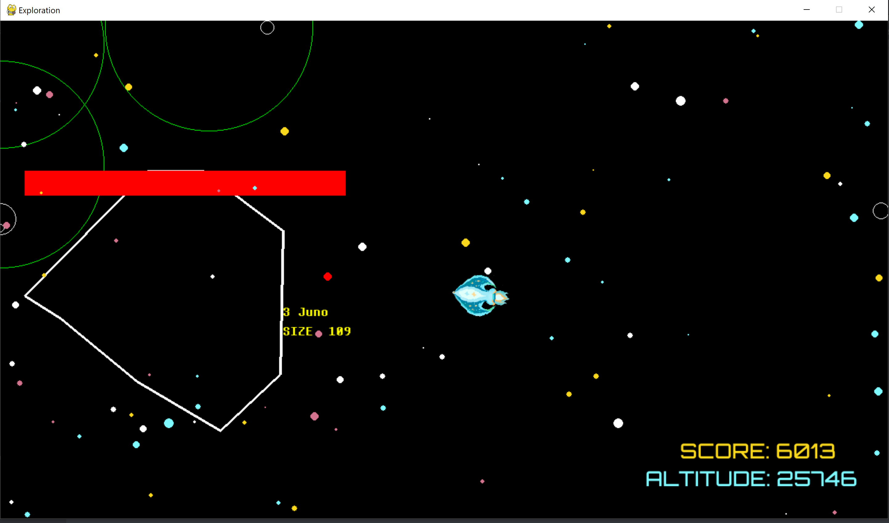

# Cygnus

## About

Operation Cygnus X-1 is a fun open world space themed game set in the distant future, where the player goes on a journey to explore the depths of our galaxy in search of a super massive blackhole called Cygnus X-1 which is said to contain the answers to the mysteries of cosmos. On this mission, the player comes across many heavenly objects, both familiar and unfamiliar, and learns some interesting facts about them! Although the hope of the mission is to travel all the way to Cygnus X-1, any information acquired by discovering new planets will help in the research. The mission ends when the player successfully returns to base after exploring their heart’s content!

##Install

- To install **Operation Cygnus X-1** either download the zip folder or clone the github repository.
- Play the game in your powershell after installing python by running the space.py file after navigating to the "Cygnus-game" folder!

## Gameplay

- **Steer** your spacecraft with the **up, down, left and right** arrow keys.

- Shoot bullets with the **spacebar**
  -  Destroy any asteroids you encounter along the way to gain more **points**!

- Your spaceship comes with a **tracker** that lets you know **the distance to the closest heavenly body.**
  - Follow the **green circles**!
  - They **decrease** in size the closer you get to a planet.

## Screenshots

#### Title Screen

#### Explore

#### Discovering Planet

#### Shooting asteroids

## Credits

Operation Cygnus is made my Aditya Manthri and Kai Tong Gao from Cornell Univeristy for the Big Red Hacks Hackathon on September 26, 2021. It was programmed in python using the library pygame. Our title screens and spaceship sprites were all designed and created in Photoshop and Illustrator with additional images from Unsplash. We also took used publicly avaliable 3d models of planets and moons provided by NASA.
